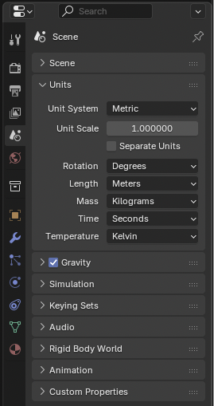

# Visualizing Colored Point Clouds in Blender (4.x) and glTF 2.0 Export

These instructions show how to import, display and export per-point colors from a `.ply` **Point Cloud object** in Blender to glTF format for use in AR/VR applications.

---

## Preparation: Import, Scale, and Center the Point Cloud

1. In a new or current Blender scene, **set** in the right-hand side panel `Properties → Scene → Units` to `Metric` with `Unit Scale = 1.0` so measurements are in meters.



2. **Import** the point cloud via `File → Import → Stanford PLY (.ply)` and select the file.
3. With the point cloud object selected, **adjust** the **Scale** values so the bounding box reflects real-world meters (e.g., data in centimeters → scale by `0.01`), then **apply** with `Ctrl+A → Scale`.


4. Press `Shift+C` to **reset** the 3D cursor to the world origin, then choose `Object → Set Origin → Origin to Geometry` to **place the origin at the object's center**.


5. **Snap** the point cloud to the origin with `Shift+S → Selection to Cursor`, and **apply** the location (`Ctrl+A → Location`) if you want zeroed transforms before continuing.


> **Note:** `Ctrl+A → Apply` writes the current scale/location values into the mesh data so transform defaults become 1/0. This keeps the glTF export aligned with real-world meters and avoids unexpected scaling when the model loads elsewhere.

## 1. Geometry Nodes Setup

1. Select your imported **Point Cloud object**.
2. Add a **Geometry Nodes modifier** → click **New**.
3. In the *Geometry Node Editor*, build this node tree:

**Nodes to add**
- Instance on Points
- Ico Sphere (Mesh Primitive)
- Realize Instances
- Set Material
- Group Input (already there)
- Group Output (already there)

**Connections**
```
Group Input.Geometry
  → Instance on Points.Points

Ico Sphere.Mesh
  → Instance on Points.Instance

Instance on Points.Instances
  → Realize Instances.Geometry

Realize Instances.Geometry
  → Set Material.Geometry

Set Material.Geometry
  → Group Output.Geometry
```

**Settings**
- **Ico Sphere → Subdivisions**: 1–2 (start with 1 for speed)
- **Ico Sphere → Radius**: `0.005–0.02` (adjust as needed)
- **Instance on Points → Pick Instance**: OFF

(Optional: If your `.ply` has a `"radius"` attribute, you can pipe it into *Instance on Points → Scale* using a **Named Attribute** node and **Capture Attribute** node.)


---

## 2. Material Setup

1. Create a **New Material** in the Shader Editor.
2. Keep the **Principled BSDF** node.
3. Add an **Attribute** node (`Shift+A → Input → Attribute`).

**Connections**
```
Attribute("Col").Color
  → Principled BSDF.Base Color

Principled BSDF.BSDF
  → Material Output.Surface
```


**Notes**
- The attribute name is usually `"Col"`, but check **Object Data Properties → Attributes** for the exact name (case-sensitive).
- If colors look dim, add an **Emission** node and mix it with the Principled BSDF.

---

## 3. Viewport & Render Checklist

- Switch to **Material Preview** or **Rendered** mode.
- Ensure the **Geometry Nodes modifier** is enabled.
- Ensure the **Set Material** node uses your new material.
- If still gray:
  - Double-check attribute name (`Col`, `color`, etc.).
  - Test by plugging `Attribute → Color` directly into an **Emission → Color**.

---

## Minimal Node Summary

**Geometry Nodes**
```
Group Input → Instance on Points → Realize Instances → Set Material → Group Output
Ico Sphere → Instance on Points
```

**Material**
```
Attribute("Col") → Principled BSDF.Base Color → Material Output.Surface
```

### Optional: Point Cloud Decimator

To thin dense scans without touching the source file, insert a lightweight decimator ahead of `Instance on Points`:

1. Add a **Random Value** (float) node and leave `Min = 0`, `Max = 1`.
2. Add a **Greater Than** node (a Math node in **Compare** mode). Press `F2` and rename it to `Keep Ratio` so the slider reads clearly in the modifier.
3. Add a **Delete Geometry** node.
4. Reroute the existing flow so `Group Input.Geometry → Delete Geometry.Geometry → Instance on Points.Points`.
5. Connect `Random Value.Value → Keep Ratio.A` and expose `Keep Ratio.B` as the percentage of points to keep (e.g., `0.35` keeps roughly 35 %).
6. Send `Keep Ratio.Result → Delete Geometry.Selection` so only points passing the comparison survive.

This randomness runs per point each time you evaluate the node tree, giving a reproducible subset once you apply or bake the modifiers.


### Optional: Coordinate-Based Point Deletion

You can carve spatial windows directly in Geometry Nodes before instancing.

**Single-axis clamp**
- Drop in a **Position** node and a **Separate XYZ** node; use the axis output you care about.
- Add **Greater Than** and **Less Than** Compare nodes, feeding the axis value into both `A` inputs and exposing their `B` values as the min/max thresholds.
- Combine the boolean results with a **Boolean Math** node set to `NAND` (or `Not And`) so points outside the window evaluate to true.
- Drive a **Delete Geometry.Selection** input with the NAND output, wired inline before `Instance on Points`.


**3D bounding box clamp**
- Duplicate the single-axis branch for X, Y, and Z, but change the Boolean Math nodes that pair min/max checks to `AND` so each axis produces a "within range" mask.
- Feed two of the three axis masks into another Boolean Math node set to `AND` to represent points inside the 3D box.
- Finish with a final Boolean Math node set to `NAND`, and connect that to `Delete Geometry.Selection` — any point outside the combined box gets culled.

The final layout below combines the 3D box clamp (all three coordinate gates) with the Keep Ratio decimator so you can preview both filters working together in a single node tree.


---

## 4. Exporting to glTF

1. Select the point cloud objects (and any supporting meshes) you need in the export.
2. Go to `File → Export → glTF 2.0 (.glb/.gltf)`.
3. In the export dialog, choose a filename and destination.
4. Under **Format**, pick `glTF Binary (.glb)` for a single file or `glTF Separate (.gltf + .bin + textures)` if you prefer external assets.
5. Under **Include**, enable **Selected Objects** so only your chosen assets are exported.
6. Under **Mesh**, enable **Apply Modifiers** to bake the Geometry Nodes output.
7. Still under **Mesh**, under **Vertex Colors** ensure **All Vertex Colors** is enabled so per-point colors are written.
8. Check **Compression** box to shrink file size during export (adjust the level if needed, 6 is maximum compression value).
9. Click **Export glTF 2.0**.


> After export, review `documentation/gltf-transform-workflow.md` for optional gltf-transform steps to post-process or compress the file and greatly reduce file size.
